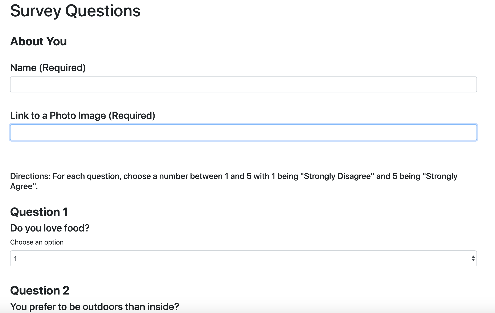

# Friend-Finder

## Summary

This is friend finder, a matching app that finds friends based on your answers to questions.

## Site Picture



## Technologies Used

Node.js - Uses Javascript to run outside of the browser. 

NPM - used to install various packages in order to run server files.
    -Express is mainly used for http servers.

## Improvements and Future Development

There is still a lot to be done to complete this project. First is to complete the comparison portion which is supposed to compare the user score to the added data in the api route. After, is to finish to modal which will display the users best match.

After completeing the base project, future development includes improvment on styling, refining the questions asked, and adding more questions.


## Code Snippet

One of the early challenges I had was trying to connect this code from the apiRoutes.js file to the server.js file and friends.js file. While it seems straight forward now, I had originally thought there would be more code needed to connect the files. However all we need is a require to friends.js, and module.exports surrounding the app.get and app.post sections which will be called in the server.js file.

``` javascript

var friends = require("../data/friends.js");

module.exports = function(app) {
    app.get("/api/friends", function(req, res) {
        res.json(friends);
    });
    
    app.post("/api/friends", function(req, res) {
        var newFriends = req.body;
        newFriends.name = newFriends.name.replace(/\s+/g, "").toLowerCase();
        console.log(newFriends);
        
        friends.push(newFriends);

    });
}

